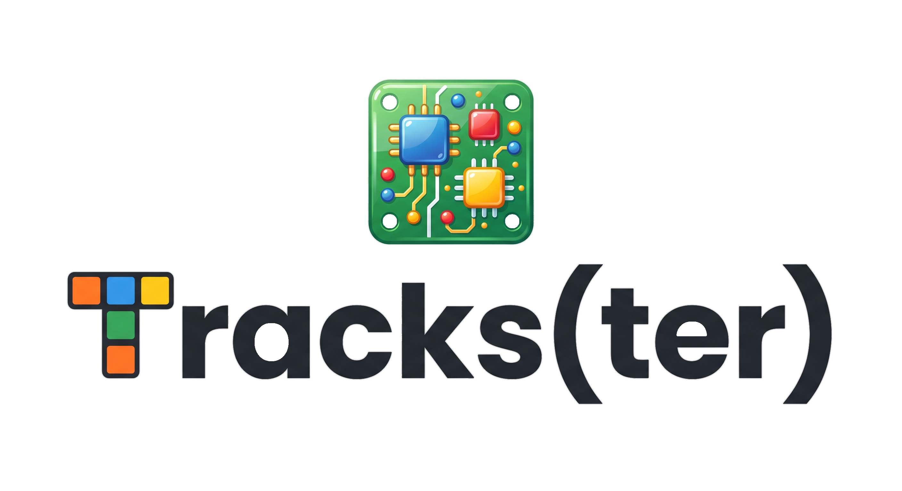

# 🎛️ Tracks(ter)

Tracks(ter) is an advanced, fully client-side web application designed for organizing, previewing, and managing samples directly on your Novation Circuit Tracks SD card.

[Novation Circuit Tracks product page](https://novationmusic.com/products/circuit-tracks)
1. Clone the repository
2. Install dependencies: `pnpm install`
3. Run the development server: `pnpm dev`
4. Open the provided local URL in a supported browser (Chrome, Edge, Arc). 

It leverages the File System Access API and Web Audio API to provide a seamless, in-browser experience for managing, renaming, and sorting audio files directly on your SD card without needing to upload anything to a server.

## Features

- **Local-first**: Reads and writes directly to your local file system (requires a Chromium-based browser).
- **Drag & Drop**: Easily rearrange your samples on a virtual grid.
- **Magic Sort**: Automatically tag and arrange your drum samples into a sensible layout.
- **Waveform Preview**: Visualize and playback audio samples directly in the app.
- **Duplicate Detection**: Scan for potential duplicates to save space on your SD card.

## Development Setup

Trackster is built using React, TypeScript, and Vite.

1. Clone the repository
2. Install dependencies: `npm install`
3. Run the development server: `npm run dev`
4. Open the provided local URL in a supported browser (Chrome, Edge, Arc).

## Deployment

Trackster is a fully client-side application and is designed to be hosted statically on GitHub Pages.

### Deploying to GitHub Pages

A GitHub Actions workflow is already configured to automatically build and deploy the `main` branch to GitHub Pages.

To enable GitHub Pages for this repository:

1. Go to the repository **Settings** on GitHub.
2. In the left sidebar, click on **Pages**.
3. Under the **Build and deployment** section, change the Source from "Deploy from a branch" to **GitHub Actions**.
4. If you are deploying to a project repository (e.g., `https://your-username.github.io/trackster/`), you will need to update the `base` path in `vite.config.ts`. Add `base: '/trackster/'` (or your repository name) to the configuration object. If deploying to a user site (`https://your-username.github.io/`), no changes are needed.
5. Push your changes to the `main` branch or trigger the workflow manually from the **Actions** tab on GitHub.
