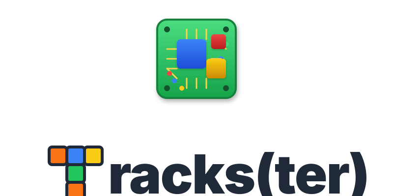
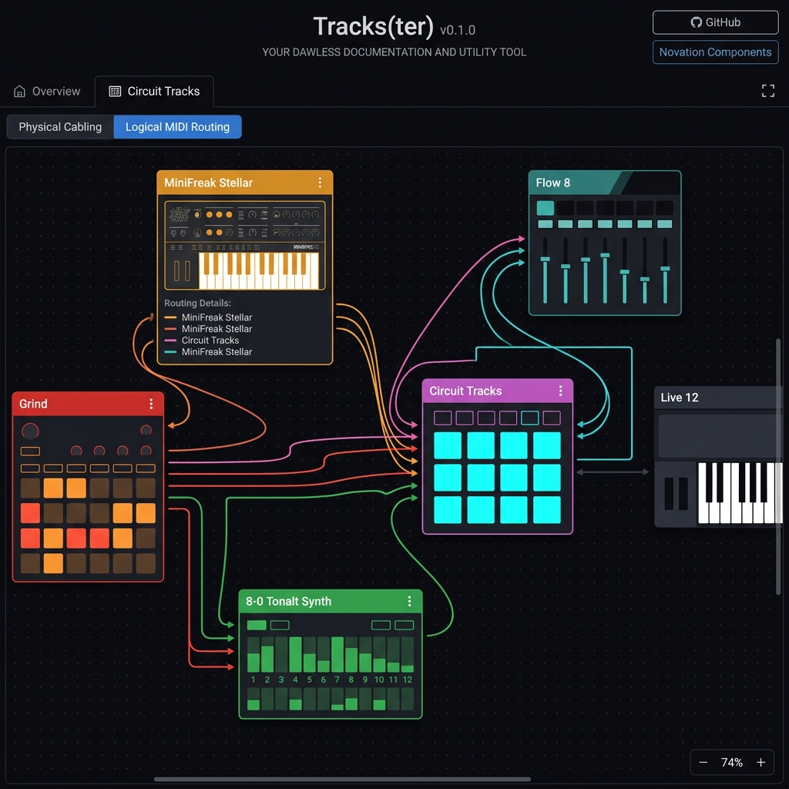

# 🎛️ Tracks(ter)

> **⚠️ EXPERIMENTAL WARNING: POTENTIAL DATA LOSS ⚠️**
> **This application is highly experimental and directly modifies the file system of your SD card. Bugs or unexpected behavior CAN and WILL lead to unrecoverable data loss (obliterated packs, renamed/deleted samples).**
> **It is MANDATORY to keep a backup of your SD card before using this tool. You have been warned! We strongly recommend using the default "Read-Only (Simulated)" mode unless you are 100% sure you want to write changes to your card.**

Trackster is an advanced, fully client-side web application designed for organizing, previewing, and managing your hybrid DAWless setup. It combines comprehensive, interactive routing canvas for your entire studio wit hardware-specific functionalities (ie: managing samples directly on your Novation Circuit Tracks SD card)

🌍 **Latest available**: [https://alienmind.github.io/trackster/](https://alienmind.github.io/trackster/)

The application leverages the File System Access API, Web Audio API, and IndexedDB to provide a seamless, in-browser experience for managing your studio hardware and sample ecosystem without needing to upload anything to a server.

## Features

- **Local-first**: Reads and writes directly to your local file system (requires a Chromium-based browser).
- **Persistent Workspace**: Uses IndexedDB to safely cache your session state, layouts, and SD card handles across reloads.
- **DAWless Overview Canvas**: An interactive SVG-based drag-and-drop canvas to visually map out your hardware synths, mixers, audio cables, and MIDI routing.
- **Hardware Integrations**: Hardware-specific sub-apps and features (e.g., Novation Circuit Tracks SD card management).
- **Tracks: Pack & Sample Organizer**: High-level views to manage all of your Circuit Tracks sample packs seamlessly, featuring a 64-pad grid mimicking the original hardware layout, allowing to review and commit file renaming and moves across your entire SD card at once.
- **Tracks: Drag & Drop between packs**: Easily rearrange your Circuit Tracks samples on a virtual grid, or drag them between packs!
- **Tracks: Magic Sort**: Automatically tag and arrange your drum samples into a sensible layout.
- **Tracks: Waveform Preview**: Visualize and playback audio samples directly in the app.
- **Tracks: Duplicate Detection**: Scan for potential duplicates to save space on your SD card.

More to come! (see [doc/FUTURE_IDEAS.md](https://github.com/alienmind/trackster/blob/main/doc/FUTURE_IDEAS.md)!)

## Development Setup

Trackster is built using React, TypeScript, and Vite.

1. Clone the repository
2. Install dependencies: `pnpm install`
3. Run the development server: `pnpm run dev`
4. Open the provided local URL in a supported browser (Chrome, Edge, Arc).

## Deployment

Although you can run it locally - is a fully client-side application - Trackster is prepared to be hosted statically on GitHub Pages.

### Deploying to GitHub Pages

If you plan to fork this code and host your own version, a GitHub Actions workflow (`.github/workflows/deploy.yml`) is already configured to automatically build and deploy the `main` branch to GitHub Pages using **pnpm**.

To enable GitHub Pages for your fork:

1. Make the repository **public** (GitHub Pages requires a paid plan for private repos).
2. Enable Pages via **Settings → Pages** and set the source to **GitHub Actions**.
3. Push to `main` (or trigger the workflow manually from the **Actions** tab) — the `VITE_BASE` env var is set automatically to match your repo name.
