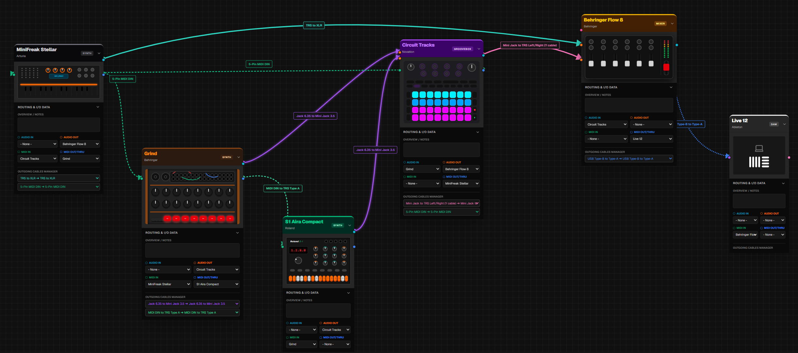
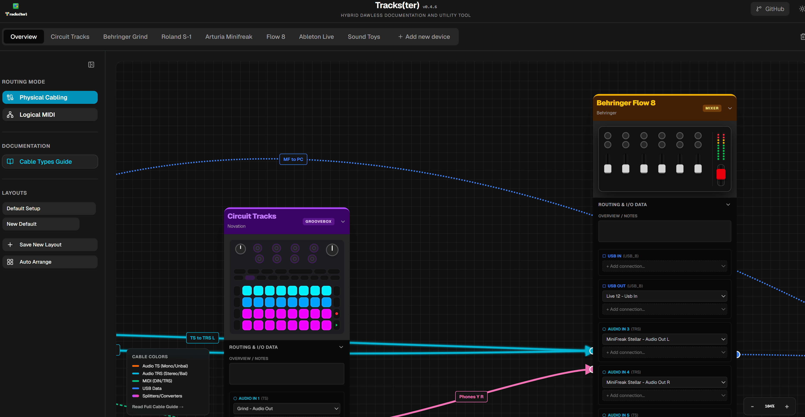
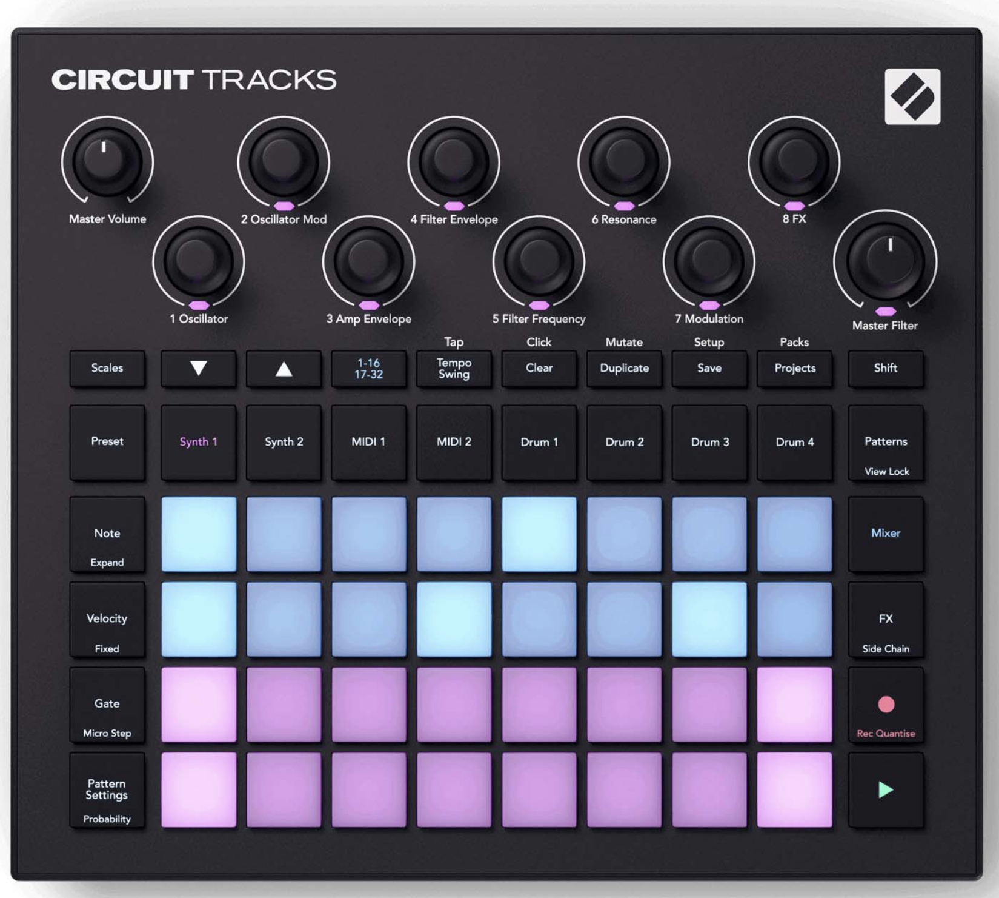
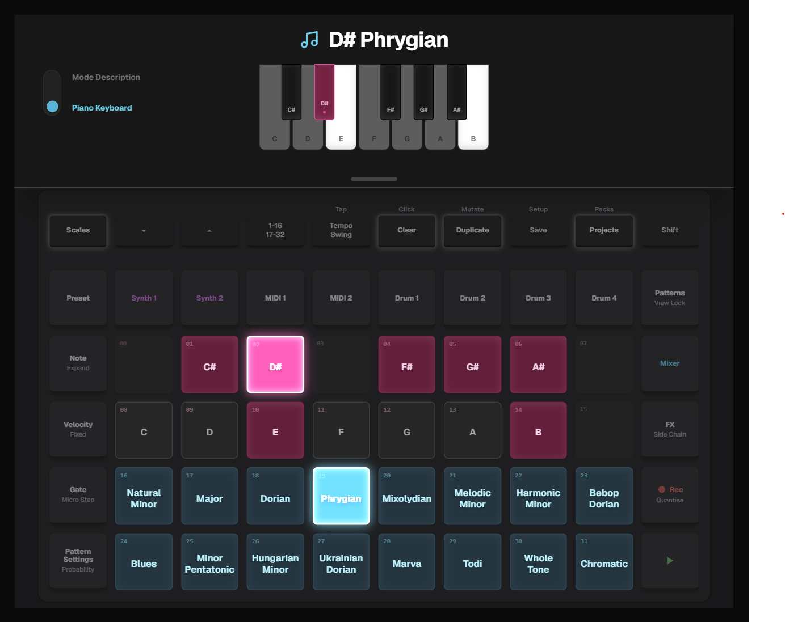
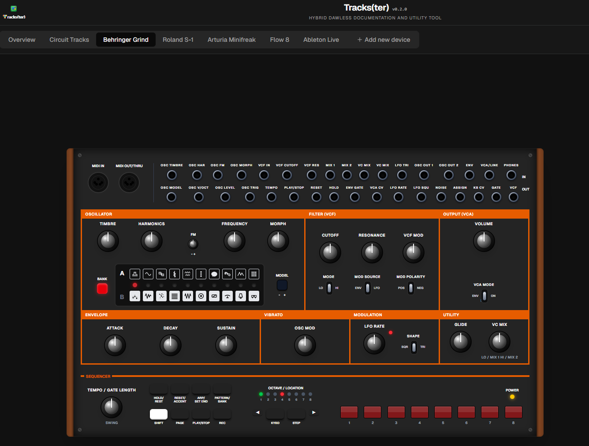

# trackster

An advanced, fully client-side web application designed for organizing, previewing, and managing a hybrid DAWless setup.

---

## Overview

# 🎛️ Tracks(ter)

🌍 **Latest production build available (served online, locally installable)**: [https://alienmind.github.io/trackster/](https://alienmind.github.io/trackster/)

> **⚠️ DISCLAIMER & CLARIFICATION ⚠️**
> **This app is not officially supported by any of the vendors mentioned in the code. It just helps me keep track and in some cases, manage features of some real instruments (the ones that I own) based on publicly available specs, manuals and APIs. However, neither their representation on screen nor the features available in the app are (or will be) a 1:1 faithful representation of the real thing; these "emulation-like" features are incomplete and are there just to get a quick impression and to fiddle around, but cannot be considered a replacement of the original instruments.**

> **⚠️ EXPERIMENTAL WARNING: POTENTIAL DATA LOSS ⚠️**
> **This application is highly experimental and in some instances directly modifies some of your device files. Bugs or unexpected behavior CAN and WILL lead to unrecoverable data loss (obliterated packs, renamed/deleted samples).**
> **It is MANDATORY to keep a backup of your data before using this tool. You have been warned! We strongly recommend using the default "Read-Only (Simulated)" mode unless you are 100% sure you want to write changes to your data.**

## About

Trackster is an advanced, fully client-side web application designed for organizing, previewing, and managing a hybrid DAWless setup. 

This is a personal pet project created to keep track of all the needed information and serve as a "legend" for my specific hybrid dawless setup. It will obviously not work directly for you out of the box, as it's hardcoded for my hardware configuration! However, I may add options to customize the layout with new device types in the future.

Additionally, this repository serves as a preservation effort. As some manufacturers (ahem, Behringer) remove critical downloads, firmware, and guides from their websites, it makes it incredibly challenging to find them on the internet. Trackster aims to centralize and archive these device-specific resources to keep our gear usable for years to come.

**Offline by Design (No Backend)**: The application leverages the File System Access API, Web Audio API, and IndexedDB to provide a seamless, in-browser experience for managing your studio hardware and sample ecosystem without needing to upload anything to a server. The complete lack of a backend or cloud sync is an intentional design decision. Trackster is meant to run entirely locally on your laptop or PC during gigs and live performances - even in the most isolated techno bunker - without relying on the internet. It serves as a robust helper tool for DJs and live performers who want quick access to all their device features from a central cockpit.

## Features & Gallery

### General Features

#### DAWless Overview Canvas
An interactive SVG-based drag-and-drop canvas to visually map out your hardware synths, mixers, audio cables, and MIDI routing.

*The interactive DAWless overview canvas, mapping out hardware synths, mixers, audio cables, and MIDI routing.*

#### Advanced Cable Management
Trackster tracks not just devices, but the literal physical cables and ports bridging your studio. It allows for complex configurations such as Y-Cables and USB hubs, and features distinct visual representations for different audio and MIDI cables. 

- **Color Coded**: Cables are visually sorted by type (Orange for TS, Cyan for TRS, Emerald for MIDI, etc.).
- **Dynamic Routing**: Click and drag a cable connection from a device to intelligently route it to another. 
- **Logical vs Physical View**: Toggle between a physical port-to-port wire diagram and a logical MIDI-channel view.
- **Save Layouts**: You can save the coordinates and wiring of an entire setup into local storage, or export it to a JSON file to easily hot-swap configurations.

*Drag and drop dynamic connection anchors between device ports, color-coded by cable type.*

#### Custom Device Creation Workflow
Want to add new gear? You can easily define new hardware models by simply pasting an image and supplying a JSON definition.

*The custom device creation workflow.*

#### Technical Features
- **Local-first**: Reads and writes directly to your local file system (requires a Chromium-based browser).
- **Persistent Workspace**: Uses IndexedDB to safely cache your session state, layouts, and SD card handles across reloads.

### Device Specific Integrations

#### Novation Circuit Tracks
Deep integration for the Novation Circuit Tracks, featuring advanced tools like sample management, wave preview, pack organization, and interactive scales exploration. Read and write directly to your SD card.

*Circuit Tracks integration featuring advanced tools like sample management, wave preview, and pack organization.*

**Track Features:**
- **Tracks: Pack & Sample Organizer**: High-level views to manage all of your Circuit Tracks sample packs seamlessly, featuring a 64-pad grid mimicking the original hardware layout, allowing to review and commit file renaming and moves across your entire SD card at once.
- **Tracks: Drag & Drop between packs**: Easily rearrange your Circuit Tracks samples on a virtual grid, or drag them between packs!
- **Tracks: Magic Sort**: Automatically tag and arrange your drum samples into a sensible layout.
- **Tracks: Waveform Preview**: Visualize and playback audio samples directly in the app.
- **Tracks: Duplicate Detection**: Scan for potential duplicates to save space on your SD card.
- **Tracks: Interactive Scales Visualizer**: Transform the 32-pad grid into an interactive scale explorer with a dedicated visual piano keyboard, highlighting active root notes and mapping emotional characteristics for 16 different scale types. Includes a live arpeggiator engine to audition scales with adjustable tempo, sequence mode, loop mode, and sustain.

*Circuit Tracks interactive scales visualizer with dynamic piano keyboard and descriptive hints.*

#### Arturia MiniFreak
Interactive UI mappings and visualization to manage patching, routing, and preset organization for the Arturia MiniFreak synthesizer.

#### Behringer Grind
Work-in-progress integration for the Behringer Grind, displaying device-specific hardware controls and routing anchors.

*Work-in-progress integration for the Behringer Grind.*

#### Roland S1
Work-in-progress integration for the Roland S1 Tweak Synthesizer, offering dynamic MIDI and audio routing visualizations.

#### Behringer Flow 8
Work-in-progress digital mixer integration to visualize input/output routing and track channel strips across your hardware setup.

... ([Read more on GitHub](https://github.com/alienmind/trackster))

